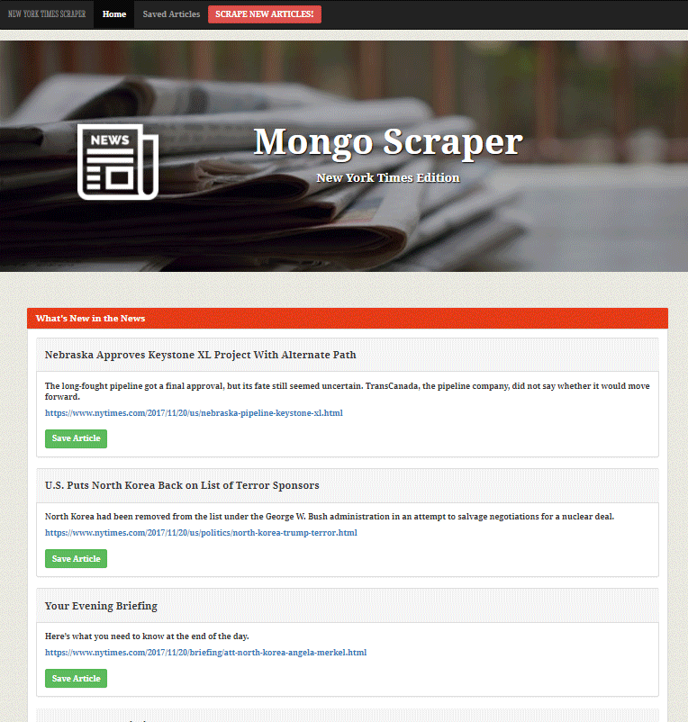

# New York Times News Hub
This application gathers the latest news articles from the New York Times website and allows you to save the articles and create notes for future use or research purposes. 

### Technology utilized:
* MongoDB
* Mongoose
* Morgan
* Axios
* Body-Parser
* Cheerio
* Handle-Bars
* Javascript / JQuery
* Moment.js
* Bootstrap

